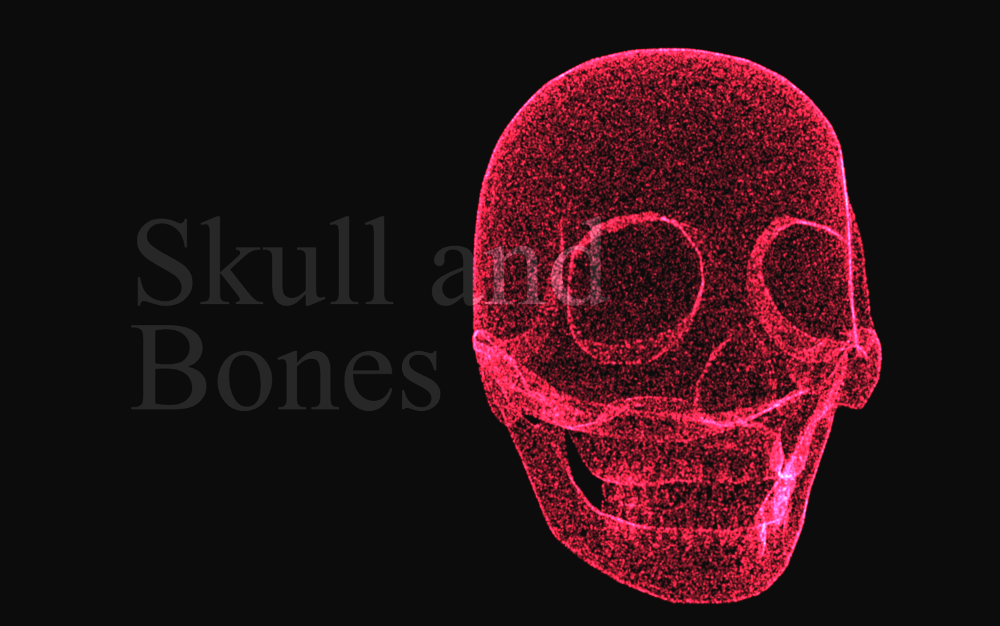

# THREEJS Particle System Skull
<h4>by Himanshu Pthak</h4>

<p align="center">
    <a href="" target="_blank"></a>
</p>

# Live Link
Click here: <a href="" target="_blank">NETLIFY LINK</a>

# Introduction
This project converts any GLTF looaded model into a particle system using threejs points material.

You can replace the model and change the camera animations to make your own scene.

Resources: [Threejs](https://threejs.org/), [WebGL](https://github.com/KhronosGroup/WebGL)


# Getting Started
Download and install Node.js on your computer (https://nodejs.org/en/download/).

Then, open VSCODE, drag the project folder to it. Open VSCODE terminal and install dependencies (you need to do this only in the first time)
```
npm install
```

Run this command in your terminal to open a local server at localhost:8080
```
npm run dev
```

# Notes
Would be really appreciated if you are willing to give me a star here on GitHub 🎉.